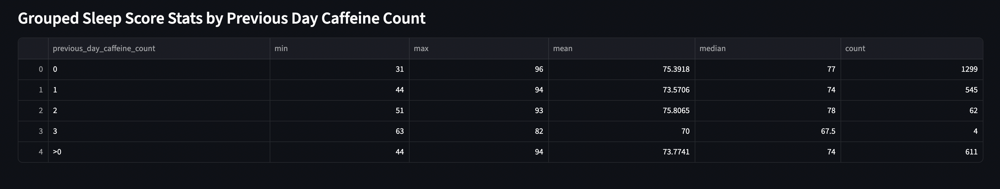
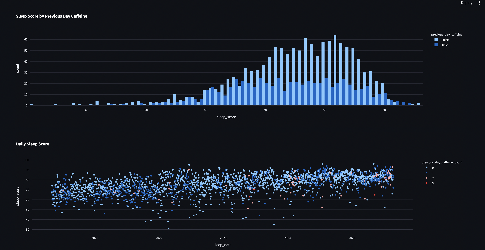
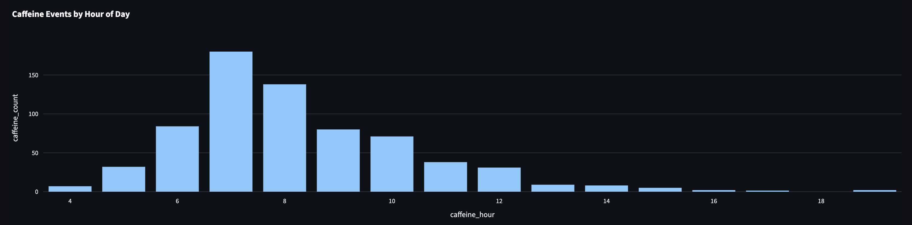
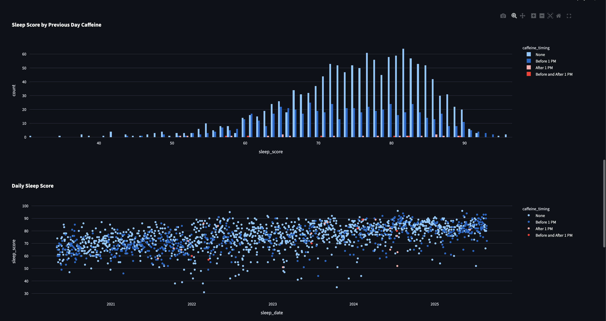

# First round summary

I found that Caffeine days are distributed very similarly around sleep score.

There were some slight numeric differences. But my opinion is the caffeine intake as such is not the main contributor

## After adding caffeine timing

We see that mostly I have drank caffeine before 1PM.

And the few times I did drink after 1PM. Also had both low and high sleep scores.

**Conclusion** my coffee consuption habits do not have a noticable effect on my sleep score.

# Stuff to try

Main suspects to explore:

- alcohol intake and timing
- training timing
